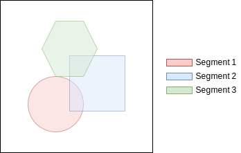
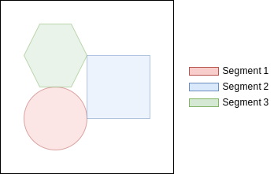
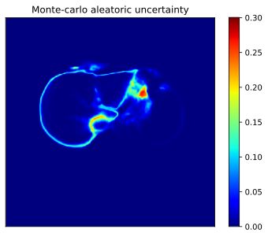

Segmentation Types
==================

Multi-label Segmentations
-------------------------

Example
^^^^^^^

DICOM Data Elements
^^^^^^^^^^^^^^^^^^^

+-----------------+------------------+------------------+
| Tag             | Tag Name         | Value            |
+=================+==================+==================+
| (0x0062,0x0001) | SegmentationType | BINARY           |
+-----------------+------------------+------------------+
| (0x0062,0x0013) | SegmentsOverlap  | YES or UNDEFINED |
+-----------------+------------------+------------------+
| (0x0028,0x0100) | BitsAllocated    | 1                |
+-----------------+------------------+------------------+
| (0x0028,0x0101) | BitsStored       | 1                |
+-----------------+------------------+------------------+
| (0x0028,0x0102) | HighBit          | 0                |
+-----------------+------------------+------------------+

Multi-class Segmentations
-------------------------

Example
^^^^^^^

DICOM Data Elements
^^^^^^^^^^^^^^^^^^^

+-----------------+------------------+--------+
| Tag             | Tag Name         | Value  |
+=================+==================+========+
| (0x0062,0x0001) | SegmentationType | BINARY |
+-----------------+------------------+--------+
| (0x0062,0x0013) | SegmentsOverlap  | NO     |
+-----------------+------------------+--------+
| (0x0028,0x0100) | BitsAllocated    | 1      |
+-----------------+------------------+--------+
| (0x0028,0x0101) | BitsStored       | 1      |
+-----------------+------------------+--------+
| (0x0028,0x0102) | HighBit          | 0      |
+-----------------+------------------+--------+

Fractional Segmentations
------------------------

The DICOM-SEG standard allows for fractional segmentations, e.g. for 
representing probabilities or the ratio of tissue composition. A floating 
point value between 0.0 and 1.0 will be quantized into an unsigned integer with
8-bits, which results in a minimum step size of ~0.39% between two integer
values. Possible use cases are:
 * Class probabilities of semantic segmentation algorithms
 * Uncertainty estimations of semantic segmentation algorithms
 * Material specific decomposition in Dual-Energy Computed Tomography (DECT)

Example
^^^^^^^

.. image:: ../_static/images/seg-fractional-probability.svg
    :alt: Example for fractional segmentation
    :width: 49%

DICOM Data Elements
^^^^^^^^^^^^^^^^^^^

+-----------------+----------------------------+--------------------------+
| Tag             | Tag Name                   | Value                    |
+=================+============================+==========================+
| (0x0062,0x0001) | SegmentationType           | FRACTIONAL               |
+-----------------+----------------------------+--------------------------+
| (0x0062,0x0010) | SegmentationFractionalType | PROBABILITY or OCCUPANCY |
+-----------------+----------------------------+--------------------------+
+ (0x0062,0x000e) | MaximumFractionalValue     | 255                      |
+-----------------+----------------------------+--------------------------+
| (0x0028,0x0100) | BitsAllocated              | 8                        |
+-----------------+----------------------------+--------------------------+
| (0x0028,0x0101) | BitsStored                 | 1                        |
+-----------------+----------------------------+--------------------------+
| (0x0028,0x0102) | HighBit                    | 0                        |
+-----------------+----------------------------+--------------------------+